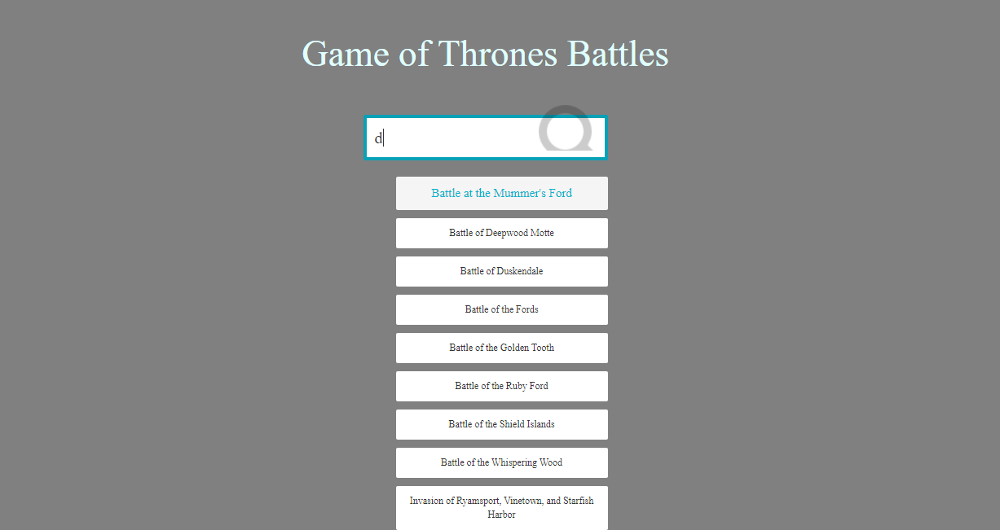
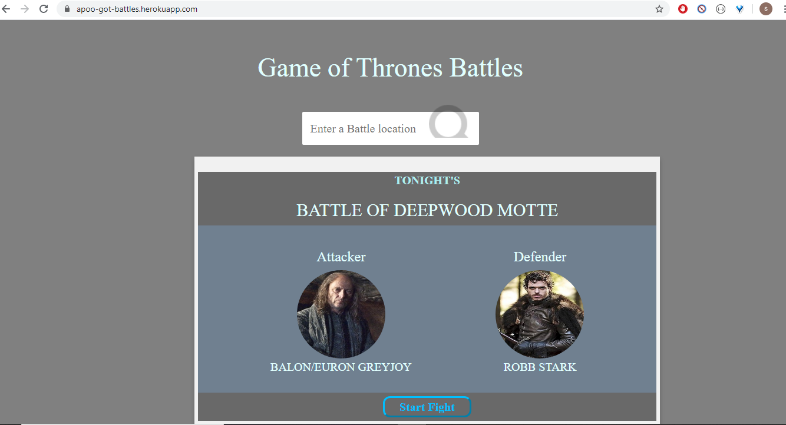

# GOT-battle-app

Here is the link to heroku app: https://apoo-got-battles.herokuapp.com/

list of API's-
/count - gives count of total no. of battles
/locations - list out all the locations
/search?king=Robb Stark - list out all the battles where king was attacker king or defender king.
/search?king=Robb Stark&type=siege&location=Riverrun etc- for multiple queries

